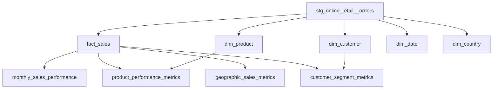

# E-Commerce Customer Analytics

<p align="center">
  End-to-end analytics engineering project built with <strong>Python</strong>, <strong>PostgreSQL</strong>, <strong>dbt</strong>, and <strong>Power BI</strong>.
</p>

<p align="center">
  
  
  
  
</p>

<<<<<<< HEAD
## Overview
=======
## Objectives
>>>>>>> bfd2b561702f20ae7df9e6b32c8318d8e5b27e6c

This project turns raw e-commerce transaction data into analytics-ready models for reporting and decision-making. It covers the full analytics workflow:

- ingest raw Excel data into PostgreSQL
- clean and standardize transactions with dbt
- model a star schema for BI consumption
- build business-facing marts for sales, customer, product, and geographic analysis
- connect the transformed data to Power BI for dashboarding

<<<<<<< HEAD
The result is a compact but practical analytics stack that demonstrates data ingestion, warehouse modeling, metric design, and dashboard delivery in one project.
=======
## Architecture
>>>>>>> bfd2b561702f20ae7df9e6b32c8318d8e5b27e6c

## Business Questions

This project is designed to answer questions such as:

<<<<<<< HEAD
- How is revenue trending month over month?
- Which customer segments generate the most value?
- Which products contribute the most revenue?
- Which countries drive the strongest sales performance?
- How do order volume, customer count, and average order value move together?
=======
## Data Modeling
>>>>>>> bfd2b561702f20ae7df9e6b32c8318d8e5b27e6c

## Solution Architecture

<<<<<<< HEAD
```text
Excel Source
   |
   v
Python Ingestion Script
   |
   v
PostgreSQL Raw Layer
   |
   v
dbt Staging Layer
   |
   v
dbt Mart Layer
   |
   v
Power BI Dashboard
=======
* **fact_sales** – transactional data (order-line level)
* **dim_customer** – customer + RFM segmentation
* **dim_product**, **dim_date**, **dim_country**

**Analytics Tables**

* `customer_segment_metrics`
* `daily_sales_performance`
* `product_performance_metrics`
* `geographic_sales_metrics`

> Optimized for direct use in BI tools.

---

## Data Layers (Medallion)

* **Bronze**: Raw CSV → PostgreSQL (`raw`)
* **Silver**: Clean & standardize (`stg_online_retail__orders`)
* **Gold**: Star schema + business metrics (`marts`)

---
## Architecture

text
>>>>>>> bfd2b561702f20ae7df9e6b32c8318d8e5b27e6c
```

Pipeline flow:

`online_retail_II.xlsx` -> `scripts/ingest.py` -> `raw.online_retail_data` -> `stg_online_retail__orders` -> marts -> Power BI

## Tech Stack

| Layer | Tool |
|---|---|
| Ingestion | Python, pandas, psycopg2 |
| Warehouse | PostgreSQL |
| Transformation | dbt |
| Visualization | Power BI |
| Exploration | Jupyter notebooks |

## Project Structure

```text
Ecommerce-Customer-Analytics-dbt/
|-- bi/
|   `-- visual.pbix
|-- data/
|   `-- raw/
|       `-- online_retail_II.xlsx
|-- models/
|   |-- staging/
|   |   |-- _staging_sources.yml
|   |   `-- stg_online_retail__orders.sql
|   `-- marts/
|       |-- core/
|       |   |-- dim_country.sql
|       |   |-- dim_customer.sql
|       |   |-- dim_date.sql
|       |   |-- dim_product.sql
|       |   `-- fact_sales.sql
|       `-- analytics/
|           |-- customer_segment_metrics.sql
|           |-- geographic_sales_metrics.sql
|           |-- monthly_sales_performance.sql
|           `-- product_performance_metrics.sql
|-- notebooks/
|   |-- 01_raw_data_exploration.ipynb
|   `-- 02_data_quality_check.ipynb
|-- scripts/
|   `-- ingest.py
|-- dbt_project.yml
|-- docker-compose.yml
|-- profiles.yml
`-- requirements.txt
```

<<<<<<< HEAD
## Data Modeling

### Staging Layer

`stg_online_retail__orders` cleans and standardizes the raw source before downstream modeling.

Main transformation logic:

- removes rows with missing `customer_id`
- converts quantity and price into usable numeric types
- filters invalid stock codes
- keeps only positive quantity and non-negative price
- standardizes country values such as `EIRE` to `Ireland`
- derives `revenue = quantity * unit_price`

### Core Mart Layer

These models form the analytical star schema:

- `fact_sales`: transaction-level fact table
- `dim_customer`: customer-level RFM metrics and segment labels
- `dim_product`: product reference table by `stock_code`
- `dim_date`: reusable calendar dimension
- `dim_country`: unique country dimension

### Analytics Mart Layer

These models are built for direct BI use:

- `monthly_sales_performance`: monthly revenue, orders, customers, units sold, AOV
- `customer_segment_metrics`: segment-level customer count, orders, revenue, AOV
- `product_performance_metrics`: product sales and customer performance
- `geographic_sales_metrics`: country-level sales contribution and revenue share

## Star Schema
=======
## Data Lineage
>>>>>>> bfd2b561702f20ae7df9e6b32c8318d8e5b27e6c



## Metrics and Business Logic

<<<<<<< HEAD
### Customer Segmentation
=======
## Dashboard (Power BI)
>>>>>>> bfd2b561702f20ae7df9e6b32c8318d8e5b27e6c

`dim_customer` implements an RFM-style framework:

- `recency`: days since latest purchase relative to the max transaction date
- `frequency`: count of distinct invoices
- `monetary`: total customer revenue

Current output segments:

- `Champions`
- `Loyal`
- `At Risk`
- `General`

<<<<<<< HEAD
### KPI Coverage
=======
## Insights
>>>>>>> bfd2b561702f20ae7df9e6b32c8318d8e5b27e6c

The marts support dashboard KPIs such as:

- total revenue
- total orders
- active customers
- total quantity sold
- average order value
- revenue share by country
- revenue by customer segment

## Dashboard Showcase

Power BI asset in repo:

- `bi/visual.pbix`

Recommended dashboard pages:

1. Executive overview
2. Monthly sales trend
3. Customer segmentation
4. Product performance
5. Geographic sales breakdown

If you want this README to look strong in a portfolio, add one clean screenshot right below this section.

Example:

```md
## Dashboard Preview


[Open Interactive Power BI Dashboard](https://app.powerbi.com/...)
```

If you export a screenshot from Power BI and save it as `bi/dashboard-preview.png`, this README is already structured to showcase it well.

## Why This Project Matters

This project demonstrates more than just SQL modeling. It shows the ability to:

- move data from raw source to reporting-ready warehouse tables
- design a dimensional model for analytics consumption
- encode business logic into reusable dbt transformations
- create marts that are practical for BI and stakeholder reporting
- connect engineering work to business-facing insights

That makes it a strong portfolio project for analytics engineering, BI engineering, or junior data engineering roles.

## How to Run

### 1. Start PostgreSQL

```bash
docker-compose up -d
```

### 2. Install dependencies

```bash
pip install -r requirements.txt
```

### 3. Load the raw dataset

```bash
python scripts/ingest.py
```

### 4. Run dbt models

```bash
dbt run --profiles-dir .
```

### 5. Run dbt tests

```bash
dbt test --profiles-dir .
```

## Local Configuration

Current development profile:

- host: `localhost`
- port: `5432`
- database: `online_retail`
- user: `dbt_user`
- target schema: `public`

dbt materialization setup:

- `staging` models are materialized as views in schema `staging`
- `marts.core` models are materialized as tables in schema `marts`
- `marts.analytics` models are materialized as tables in schema `marts`

## Next Enhancements

- add dashboard screenshots to the README
- publish the Power BI dashboard and attach a public or portfolio-safe link
- add more dbt tests for uniqueness and relationships
- generate and share dbt docs
- document KPI definitions for business users

## Author

Built by Trieu as a portfolio project focused on analytics engineering, dimensional modeling, and dashboard-ready data transformation.

