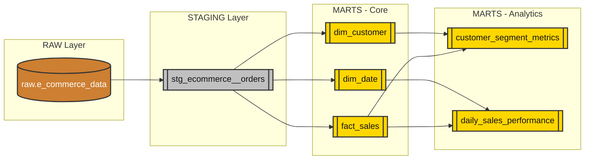

# 🛒 E-Commerce Customer Analytics (dbt Pipeline)

This project provides a robust, production-ready data transformation pipeline for e-commerce transaction data using **dbt** (data build tool) and **PostgreSQL**. The pipeline extracts insights on sales performance and analyzes customer behavior through RFM (Recency, Frequency, Monetary) segmentation.

---

## 🏛 Data Architecture (Medallion Approach)

We strictly follow the **Medallion Architecture** to guarantee data quality and logical separation of transformations.

### 🥉 Bronze Layer (Raw Data)
- **Source**: E-commerce transactional CSV files.
- **Role**: Data is ingested *as-is* without any alterations into the `raw` schema in PostgreSQL via high-speed `COPY` commands (`scripts/load_csv.py`). All data columns are mapped as `VARCHAR` to prioritize load performance and prevent ingestion failures.

### 🥈 Silver Layer (Staging & Cleansing)
- **Location**: `models/staging/`
- **Role**: Standardize, cast data types, handle missing/null values, and rename columns to standardize conventions. 
- **Models**: Includes `stg_ecommerce__orders` which converts the raw `VARCHAR` data into proper `integer`, `numeric`, and `timestamp` fields natively in PostgreSQL.

### 🥇 Gold Layer (Core Models & Analytics Marts)
- **Location**: `models/marts/`
- **Role**: Houses the business logic and final aggregated metrics ready for BI tools (like Metabase, Power BI, Tableau).
- **Sub-layers**:
  - **Core (`models/marts/core/`)**: Dimensional modeling (Entities/Facts) including `dim_customer` (with RFM logic embedded), `dim_date`, and `fact_sales`.
  - **Analytics (`models/marts/analytics/`)**: Pre-calculated metrics such as `customer_segment_metrics` and `daily_sales_performance`.

---

## 🔗 Data Lineage

The flow of data through our dbt models is mapped below.

---

## 📊 Entity Relationship Diagram (ERD)

*(Chú ý: Để thay thế hình dưới đây, bạn chỉ cần copy hình ảnh ERD của bạn vào thư mục dự án và cập nhật lại đường dẫn file ảnh trong file markdown này)*

### 1. Core Data Model (Star Schema)
> Thêm hình ảnh thiết kế Fact/Dim của bạn ở đây.

### 2. Analytics Marts
> Thêm hình ảnh mô hình các bảng phục vụ Dashboard ở đây.

---

## 🚀 Quick Start & Run Guide

For a detailed step-by-step guide on how to launch the PostgreSQL database, ingest raw CSV files, and run the `dbt` pipeline, please refer to the dedicated run guide below:

👉 **[Xem Hướng Dẫn Chạy Project (RUN_GUIDE.md)](RUN_GUIDE.md)**
