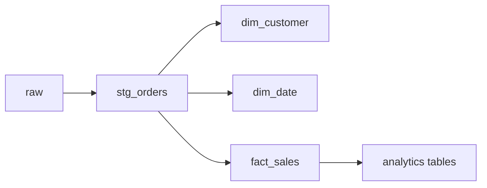

# 🛒 E-Commerce Customer Analytics

End-to-end data pipeline for analyzing e-commerce transactions and customer behavior using **dbt** and **PostgreSQL**, delivering business-ready data for Power BI dashboards.

---

## 🎯 Objectives

* Customer segmentation using RFM (Recency, Frequency, Monetary)
* Revenue and sales trend analysis
* Identify high-value and at-risk customers

---

## 🏗️ Architecture

Raw CSV → Python → PostgreSQL → dbt (Staging → Mart) → Power BI

---

## 📊 Data Modeling

**Star Schema**

* **fact_sales** – transactional data (order-line level)
* **dim_customer** – customer + RFM segmentation
* **dim_product**, **dim_date**, **dim_country**

**Analytics Tables**

* `customer_segment_metrics`
* `daily_sales_performance`
* `product_performance_metrics`
* `geographic_sales_metrics`

> Optimized for direct use in BI tools.

---

## 🏛️ Data Layers (Medallion)

* **Bronze**: Raw CSV → PostgreSQL (`raw`)
* **Silver**: Clean & standardize (`stg_online_retail__orders`)
* **Gold**: Star schema + business metrics (`marts`)

---

## 🔗 Data Lineage



---

## 📊 Dashboard (Power BI)

*In progress*

Planned:

* Revenue trends
* RFM segmentation
* Top customers
* Sales by country

---

## 💡 Insights

Planned:

* Customer segmentation behavior
* Revenue contribution by segments
* Seasonal trends

---

## 🚀 Run

```bash
docker-compose up -d
dbt run
```

👉 Full guide: [Run Guide](./RUN_GUIDE.md)
