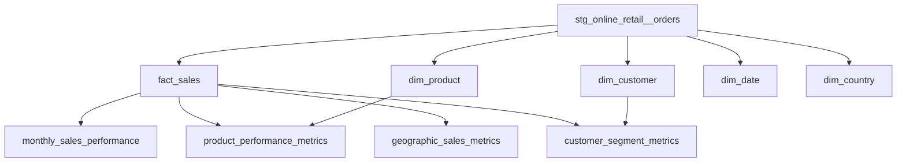

# E-Commerce Customer Analytics

End-to-end analytics engineering project using **Python**, **PostgreSQL**, **dbt**, and **Power BI**.

## Overview

This project transforms raw e-commerce transaction data into analytics-ready models for reporting and decision-making.

## Objectives

This project is designed to support production-style analytics use cases:
- track revenue, order volume, and average order value over time
- identify high-value customer segments for retention and growth analysis
- measure product performance to support merchandising decisions
- compare country-level sales contribution across markets
- provide reliable, dashboard-ready data for business reporting

Technical goals:

- ingest raw Excel data into PostgreSQL
- clean and standardize data with dbt
- build a star schema for analytics
- create marts for sales, customer, product, and geography analysis
- connect the final models to Power BI

## Pipeline

```text
Excel -> Python ingestion -> PostgreSQL raw -> dbt staging -> dbt marts -> Power BI
```

Data flow:

`online_retail_II.xlsx` -> `scripts/ingest.py` -> `raw.online_retail_data` -> `stg_online_retail__orders` -> marts -> Power BI

## Tech Stack

| Layer | Tool |
|---|---|
| Ingestion | Python |
| Warehouse | PostgreSQL |
| Transformation | dbt |
| Visualization | Power BI |
| Exploration | Jupyter notebooks |

## Core Models

- `stg_online_retail__orders`: cleans and standardizes raw transactions
- `fact_sales`: transaction-level fact table
- `dim_customer`: customer metrics and RFM-based segments
- `dim_product`, `dim_date`, `dim_country`: supporting dimensions

Analytics marts:

- `monthly_sales_performance`
- `customer_segment_metrics`
- `product_performance_metrics`
- `geographic_sales_metrics`

## Business Questions

- How is revenue trending over time?
- Which customer segments generate the most value?
- Which products drive the most revenue?
- Which countries perform best?
- How do orders, customers, and average order value change together?

## Data Lineage



## How to Run

```bash
docker-compose up -d
pip install -r requirements.txt
python scripts/ingest.py
dbt run --profiles-dir .
dbt test --profiles-dir .
```
